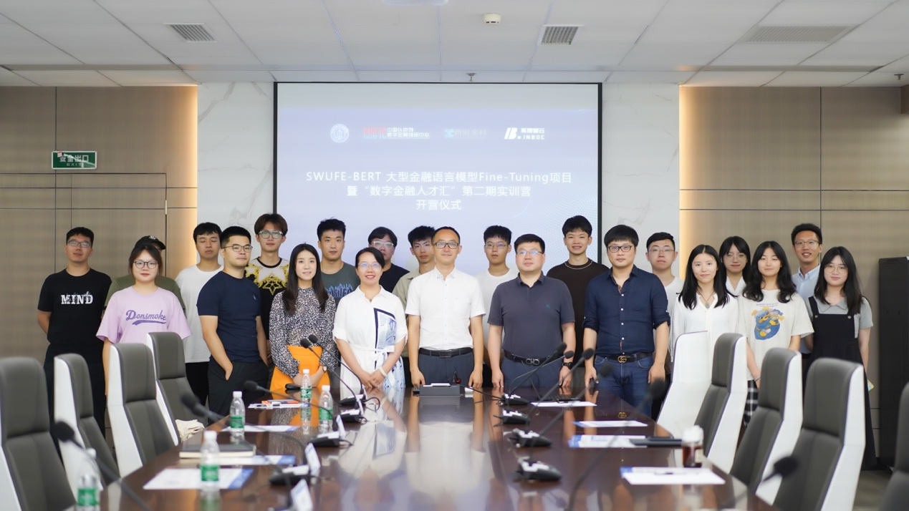

# SWUFE-BERT-Extract-Summary

##  1.SWUFE FIC

金融科技国际联合实验室是西南财经大学和成都市政府重点打造的 ，面向国内国际知名高校 、金融 机构和企业开放合作的金融科技学科平台 。实验室于2019年5月正式成立，聚焦金融科技前沿问题研 究，积极对接国内外顶尖高校 、政府以及行业监管机构多方资源；同时,与业界紧密合作 ，攻关重 大项目，研发金融科技解决方案。实验室科研团队核心成员皆是具有海外背景的高端人才，秉承“心 有大我，至诚报国”的实验室建设理念，以赤诚之心钻研技术难题，以报国之行提供社会服务。目前，实验室已成功组织策划了两届国际金融科技论坛及国际大学生金融科技黑客马拉松大赛 “成都80”， 聚集了平安集团 ，中国建设银行，中投公司，美国道富银行，瑞士再保险，穆迪公司以及北大，清华，加州大学伯克利分校，MIT，多伦多大学等国内国际业界学界一流资源，以及诺奖得主Robert Merton , Lars Hansen 等顶级人才的参与。实验室将坚持立足金融科技理论研究与项目开发，用金融 科技解决业界痛点问题，打造金融科技创新生态圈。

The Southwestern University of Finance and Economics Fintech Innovation Lab (FIC) is a financial science and technology discipline platform built by Southwestern University of Finance and Economics and Chengdu Municipal Government. The lab was formally established in May 2019, focusing on the research of cutting-edge issues of FinTech, and actively linking up the resources of top universities, governments and industry regulators at home and abroad; at the same time, working closely with the industry to tackle major projects and develop FinTech solutions. The core members of FIC scientific research team are all high-end talents with overseas backgrounds. Adhering to the lab construction philosophy of "having a great heart, serving the country sincerely", FICers will study technical problems with sincere hearts, and provide social services to serve the country. At present, FIC has successfully organized and planned two international FinTech forums (SWUFE-CDAR annual conference) and international college students’ FinTech hackathon contest "Chengdu 80", bringing together Ping An Group, China Construction Bank, China Investment Corporation, State Street Bank, Swiss Re, Moody's, Peking University, Tsinghua University, University of California, Berkeley, MIT, University of Toronto and other domestic and international first-class resources in the industry and academia, as well as Nobel Prize winners Robert Merton, Lars Hansen and other top talents. FIC will stick to the theoretical research and project development of FinTech, use FinTech to solve the pain points in the industry, and create a FinTech innovation ecosystem.

## 2.Project Introduction

The SWUFE-BERT, a large-scale financial language model, will undergo pre-training and fine-tuning in a corpus exceeding 200 gigabytes, comprising 17 million financial news articles and institutional research reports. The objective is to construct a financial domain dictionary, offering an end-to-end natural language processing framework tailored for financial scenarios. It will be open-sourced to assist financial academic research and industry applications, addressing gaps in this field.

To assess the effectiveness of the SWUFE-BERT pre-training model, we initiated downstream experiments in chapter-level extractive automatic text summarization. Building on this foundation, we conducted comparative experiments between **SWUFE-BERT**, **Google's native Chinese BERT**, and **RoBERTa-wwm-ext-large**, an open-source model from the Harbin Institute of Technology and iFLYTEK Lab.

The specific experiment involves contrasting the performance of the three BERT pre-training models in automatically generating extractive summaries for financial briefings. The process includes preparing a supervised corpus of 10,000 financial briefings, with 5,000 containing a mix of non-financial content and 5,000 being high-quality financial briefings. Subsequently, the three BERT models are individually employed to pre-train the corpus, forming word embeddings. Deep learning models, specifically LSTM and TransformerEncoder, are then utilized for training and predicting abstracts. Finally, the training outcomes and prediction results are compared to evaluate performance.

## 3.Group Member and Example of Report Website

**Group Member: Kaichuang Yang, Xinyan Zhao, Yuan Wang, Yuxin Gong**

**Supervisor: *Prof.* Yu Zheng(SWUFE) & *Dr.* Yongxin Yang(QMUL)**

**Example of Report Website** [link to pdf](https://github.com/KaichuangYang/SWUFE-BERT-Extract-Summary/blob/main/summary-report-0818-1.pdf)
